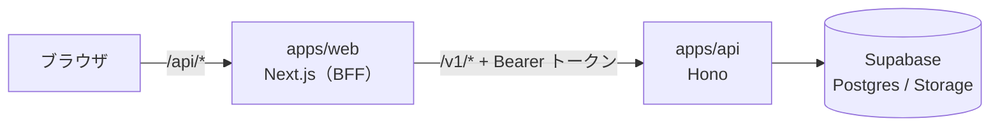

# Pitari

部屋の服を撮影して DeepFashion2 のランドマークと一緒に保存し、体型を変えられる .glb アバターに着せるクローゼットアプリ。

## 構成

- `apps/web`：画面と BFF。DB と Supabase には触れない。ルールは [apps/web/AGENTS.md](apps/web/AGENTS.md)
- `apps/api`：DB と Storage に触れる唯一の場所。ルールは [apps/api/AGENTS.md](apps/api/AGENTS.md)
- 推論（DeepFashion2）をどこで動かすかは未定

## コマンド

| やること                        | コマンド                                       |
| ------------------------------- | ---------------------------------------------- |
| 依存を入れる（git hook も入る） | `pnpm install`                                 |
| web と api を起動               | `pnpm dev`                                     |
| lint / 型チェック / 整形        | `pnpm lint` / `pnpm typecheck` / `pnpm format` |
| build（CI でも流す）            | `pnpm build`                                   |
| ローカルの Supabase を起動      | `supabase start`                               |
| DB の型を生成                   | `pnpm --filter @pitari/api db:types`           |

初回の手順は [docs/setup.md](docs/setup.md)。

## docs の地図

- [docs/api.md](docs/api.md)：API 一覧
- [docs/er.md](docs/er.md)：ER 図
- [docs/requirements-candidates.md](docs/requirements-candidates.md)：今は入れないが、足すかもしれない要件
- [docs/adr/](docs/adr/README.md)：決めたことと、その理由

## 既知のリスク（ログインがまだ無い）

URL を知っていれば、誰でも `/api/*` を叩けて、服の登録や削除までできてしまう。DB のキーは api にしか無いので、DB を直接触られることはない。経緯と撤去条件は [docs/adr/0002-no-login-yet.md](docs/adr/0002-no-login-yet.md)。

ログインを入れるまで、このリスクを広げる変更（個人を特定できる情報を返す API など）は入れない。

## ルール

### コードの書き方

- **後から読む人が迷わないコードにする**：凝った書き方より、素直で読みやすい書き方を選ぶ。名前は、チームの誰が見ても意味が通じる言葉にする（略語や造語は避ける）。共通化は、本当に同じものだけにする
- **コメントは最低限、「なぜ」だけを考える**：何をしているかはコードで分かるようにする
- **仕様番号は振らない**：分かりにくいため
- **参考文献を書く**：お互いの勉強になるので、Qiita や Zenn などで調べて、参考にした記事の URL をコメントや docs に残す。実際に読んだものだけを載せる
- **import はエイリアスを使う**：相対パス（`../../`）は分かりにくすぎるため。web は `@/`、api は `#src/`。ESLint で止まる
- **古い書き方（deprecated）を避ける**：Next.js は、バンドルされた docs（`apps/web/node_modules/next/dist/docs`）で今の書き方を確かめる
- **docs とコメントは日本語で書く**

### 境界とセキュリティ

- **外部 API と backend の呼び出しは server-only で行う**：ハッカソンとはいえ、開発者ツールで中身が見えたら話にならないため。呼び出しのコードは `apps/web/src/server/` に置き、ファイルの先頭で `server-only` を import する（クライアント側から読み込むと build が止まる。CI でも build する）。秘密の値は `NEXT_PUBLIC_` で始まる環境変数にしない（ブラウザに埋め込まれる）
- **`.env` は commit しない**：値を足したら `.env.example` も更新する

### DB と API

- **DB の変更は `supabase/migrations` からだけ行う**：ダッシュボードで直接変えると、他の人の手元に再現できないため。新しいテーブルは RLS を有効にし、[docs/er.md](docs/er.md) も更新する
- **API を足すときは [docs/api.md](docs/api.md) から書き始める**：その後に zod のスキーマ、api の route、web の BFF の順で書く
- **要件は変わる前提**：API 一覧と ER 図は最低限にしてある。足すかもしれない要件は [docs/requirements-candidates.md](docs/requirements-candidates.md) に書く

### 進め方

- **決めたことは `docs/adr/` に1件ずつファイルで残す**：書き方は [docs/adr/README.md](docs/adr/README.md)
- **`git commit --no-verify` は使わない**：commit 前の format と lint（lefthook）を飛ばさないため

## AI ツールの権限

Claude Code は [.claude/settings.json](.claude/settings.json)、Codex は [.codex/rules/project.rules](.codex/rules/project.rules) に、同じ方針で書いてある。片方を変えたら、もう片方も合わせる。

- 止めるもの：`.env` の読み取り（Claude のみ）、force push、`--no-verify`、クラウドの DB への反映（`supabase db push` など）
- 確認するもの：依存の追加（`pnpm add`）、`git push`、`supabase link`

`.env` の読み取り禁止は、Claude のファイルツールと `cat` などには効くが、スクリプトの中で読むことまでは防げない。

### 止められる範囲

|                                     | Claude Code          | Codex                                      |
| ----------------------------------- | -------------------- | ------------------------------------------ |
| フラグの位置                        | どこにあっても止まる | 先頭に書いた形だけ止まる                   |
| 例：`git push origin main --force`  | 止まる               | 止まらない（通常の push と同じく確認だけ） |
| 例：`git commit -m wip --no-verify` | 止まる               | 止まらない                                 |
| `.env` の読み取り                   | 止まる               | 止まらない                                 |

Codex の rules はコマンドの先頭一致でしか書けないため。Claude も、`git -C . push --force` のような別の書き方までは見分けられない。どちらの AI も、人が手で打つコマンドは止められない。最後の砦は GitHub 側の main の保護（PR 必須・CI 必須・force push 禁止）で、設定はリポジトリの管理者にお願いしている。

## 参考文献

- [Next.js: Preventing environment poisoning（server-only）](https://nextjs.org/docs/app/getting-started/server-and-client-components#preventing-environment-poisoning)
- [Next.jsの環境変数のセキュリティ（Zenn）](https://zenn.dev/masato24524/articles/eb87246a0bada1)：`NEXT_PUBLIC_` 付きの環境変数にした API キーが、開発者ツールで見えてしまった例
- [【TypeScript】importする際相対パスではなくエイリアスを使用する（Zenn）](https://zenn.dev/tusi/articles/31fac753cf0150)
- [Claude Code: Configure permissions](https://code.claude.com/docs/en/permissions)
- [Codex: Rules](https://learn.chatgpt.com/docs/agent-configuration/rules)
