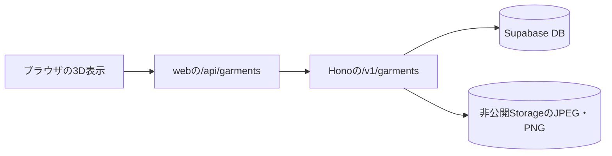

# 3D担当向けのデータ引き継ぎ

2026-10-10時点の実装。採寸・登録機能はローカルの`integration/local-measurement-20261010`にあり、この資料の作成時点では未コミット・未push。相手がGitHubのmainを取得するだけでは、以下のAPI・型・migrationはまだ届かない。

## 最初に共有すること

3D表示側は、既存APIから服の`category`と`measurements`を受け取る。寸法は服の寸法であり、人の体型ではない。`measurementVersion`も確認する。写真からの3Dメッシュ生成、GLBの読み込み、アバター体型の保存、テクスチャ生成はまだ実装していない。

写真→A4から縮尺を算出→ランドマーク推定または手動指定→cmへの換算→ユーザーの数値修正→透過画像とともに保存、という流れ。写真全体を変形する遠近補正は廃止した。3D側は最後に保存した寸法を使う。点から再計算すると、ユーザーによる数値修正を失う場合がある。

このPCではHRNetの学習済み重みを配置し、CPUでの読み込みと合成画像への推論を確認した。実写真での精度・速度は別途検証が必要。各開発者のモデル配置は[推論README](../apps/inference/README.md)を参照する。

## データの取得経路



ブラウザからは同じサイトの`/api/*`を呼ぶ。DBやHonoへ直接接続しない。内部トークンとSupabaseの秘密キーはサーバー側だけで扱う。

スマホで画像を表示するときも、`/api/garments/{服ID}/images/{画像ID}`を使う。既存のimages[].urlは署名URLとして残しているが、ローカル開発では127.0.0.1を含むためスマホから直接アクセスできない。クローゼット用画像を選ぶ例は`apps/web/src/lib/garment-photo.ts`のgarmentPhotoUrlを参照する。

| リクエスト                                    | レスポンス                            | 用途                   |
| --------------------------------------------- | ------------------------------------- | ---------------------- |
| `GET /api/garments`                           | `{ garments: GarmentView[] }`         | 新しい順の最新100件    |
| `GET /api/garments?category=short_sleeve_top` | 同上                                  | Tシャツだけ取得        |
| `GET /api/garments?category=trousers`         | 同上                                  | パンツだけ取得         |
| `GET /api/garments/{id}`                      | `GarmentView`                         | 選んだ1着の最新データ  |
| `GET /api/measurements`                       | `{ definitions, measurementVersion }` | 採寸項目・点番号・倍率 |

`{id}`は服のUUID。画像IDやランドマーク番号とは別。ログイン前なのでapiが固定のDEMO_PROFILE_IDを使う。profile_idを画面から送らない。

クライアントコンポーネント内で使う例：

```ts
import type { GarmentView } from "@pitari/api";
import { requestJson } from "@/lib/request";

const { garments } = await requestJson<{ garments: GarmentView[] }>(
  "/api/garments",
);
const selected = garments.at(0);

if (selected) {
  const garment = await requestJson<GarmentView>(
    `/api/garments/${encodeURIComponent(selected.id)}`,
  );
  // この後、モデル固有の変形処理へgarment.measurementsを渡す。
}
```

型の共有は`import type`を使う。上の例はデータ取得部分だけで、3D表示処理は含まない。取得失敗の表示、服の選択状態、3Dエンジンの初期化・破棄は表示コンポーネント側で扱う。

## APIで受け取るJSON

実際の型は[garment-records.ts](../apps/api/src/lib/garment-records.ts)の`GarmentView`。次は**旧v1形式**の説明用データで、実測結果ではない。URL部分も説明用の文字列。旧データの読み出しは引き続き可能。現在のv2ではmeasurement画像にpaperCornersも入り、originalの代わりにcutout画像を保存する。

```json
{
  "id": "11111111-1111-4111-8111-111111111111",
  "name": "白いTシャツ",
  "category": "short_sleeve_top",
  "measurements": {
    "shoulderWidthCm": 45,
    "sleeveLengthCm": 22,
    "bodyWidthCm": 50,
    "bodyLengthCm": 70,
    "waistCm": null,
    "hipCm": null,
    "thighWidthCm": null,
    "riseCm": null,
    "inseamCm": null,
    "hemWidthCm": null
  },
  "measurementVersion": "df2-a4-midpoint-v1",
  "createdAt": "2026-10-10T03:00:00Z",
  "images": [
    {
      "id": "22222222-2222-4222-8222-222222222222",
      "role": "measurement",
      "url": "APIが返す期限付き画像URL",
      "widthPx": 1200,
      "heightPx": 1800,
      "points": [
        { "id": 7, "x": 300, "y": 250, "score": null },
        { "id": 25, "x": 975, "y": 250, "score": null }
      ],
      "pixelsPerCm": 15,
      "paperCorners": [],
      "modelVersion": null
    },
    {
      "id": "33333333-3333-4333-8333-333333333333",
      "role": "original",
      "url": "APIが返す期限付き原画像URL",
      "widthPx": 1000,
      "heightPx": 1500,
      "points": [],
      "pixelsPerCm": null,
      "paperCorners": [
        [50, 50],
        [260, 50],
        [260, 347],
        [50, 347]
      ],
      "modelVersion": null
    }
  ]
}
```

この例の肩幅は675px÷15px/cmで45cm。ほかの寸法は数値の直接入力でも保存できる。全寸法が現在のpointsだけから復元できるとは限らない。

| キー                 | 型と意味                                                      |
| -------------------- | ------------------------------------------------------------- |
| `id`                 | 服を識別するUUID文字列                                        |
| `name`               | 服の名前。空文字列の場合もある                                |
| `category`           | `short_sleeve_top`または`trousers`                            |
| `measurements`       | 全10項目の確定値。各項目はnumberまたはnull                    |
| `measurementVersion` | 採寸方式の版。現在は`df2-a4-flat-midpoint-v2`。旧v1も存在する |
| `createdAt`          | 作成日時。更新日時ではない                                    |
| `images`             | 画像ごとのメタデータ。配列の順番には依存しない                |

## 寸法の意味

全項目の単位はcm。自動計算は小数1桁に丸めるが、保存API自体は小数1桁に限定していない。保存時は0より大きく1000以下、またはnullを許す。0は未測定の意味で使わない。

| 服      | キー              | 意味                 | 写真からの計算       |
| ------- | ----------------- | -------------------- | -------------------- |
| Tシャツ | `shoulderWidthCm` | 肩幅                 | 7–25の距離           |
| Tシャツ | `sleeveLengthCm`  | 片側の袖丈           | 7–9の距離            |
| Tシャツ | `bodyWidthCm`     | 平置きの身幅         | 12–20の距離          |
| Tシャツ | `bodyLengthCm`    | 指定した定義の着丈   | 1–16の距離           |
| パンツ  | `waistCm`         | ウエスト周囲の推定値 | 1–3の距離×2          |
| パンツ  | `hipCm`           | ヒップ周囲の推定値   | 4–14の距離×2         |
| パンツ  | `thighWidthCm`    | 平置きのわたり幅     | 9–14の距離           |
| パンツ  | `riseCm`          | 股上                 | 2–9の距離            |
| パンツ  | `inseamCm`        | 股下の独自定義       | 9から7・11の中点まで |
| パンツ  | `hemWidthCm`      | 平置きの片脚の裾幅   | 11–12の距離          |

番号はDeepFashion2のカテゴリ内で1始まり。距離をpixelsPerCmで割ってから、必要な項目だけ2倍する。[計算の実装](../apps/api/src/lib/measurements.ts)を正とする。

3D担当との受け渡しで守ること：

- `waistCm: 80`はすでに周囲80cm。さらに2倍しない。
- `bodyWidthCm: 50`は平置き幅50cm。胸囲50cmとして扱わない。身体の胸囲でもない。
- わたり幅・裾幅は幅で、周囲長ではない。
- 股下は一般的な片脚の縫い目に沿う長さと異なる。モデルのパラメータ名がinseamでも、そのまま一致するとは限らない。股上と足して総丈として扱わない。
- nullは未測定・点不足・対象外など。0へ置き換えない。必要な寸法が欠けているときに入力を求めるか、モデルの初期寸法を使うかは3D側の仕様として決める。
- APIは全10項目を持つ。通常はカテゴリに関係しない項目がnullだが、3D側はcategoryに応じて使用項目を選ぶ。
- 写真の点や縮尺がなくても、手入力された寸法は有効。3D表示にpointsの存在を必須にしない。

## 画像とランドマークの座標

### 画像のrole

- `measurement`：採寸するJPEG。v2ではブラウザで向き・縦横比を維持した縮小・EXIF除去を済ませた長辺1600px以下の写真を変形せず保存する。点とA4四隅はこの画像上の座標。
- `cutout`：クローゼット表示用の背景透過PNG。服の輪郭を抽出し、余白を切り詰めた画像。points・paperCornersは空配列、pixelsPerCm・modelVersionはnull。採寸や3DのUVテクスチャには使わない。
- `original`：旧v1の遠近補正前JPEG。旧データではmeasurementが補正後JPEG、A4四隅はoriginalにある。

現在の画面からはmeasurementとcutoutの2枚を保存する。服1着につき各roleは最大1枚。クローゼットでは`images.find((image) => image.role === "cutout")`を優先し、旧データではmeasurementへフォールバックする。点を見るときは必ずmeasurementを選ぶ。

### points

`{ id, x, y, score }[]`。xは右向き、yは下向きで、左上が原点の画像ピクセル座標。正規化した0〜1の座標でも、3DのXYZでもない。

- `images[].id`は画像のUUID、`points[].id`はカテゴリ内の点番号。
- Tシャツは1〜25、パンツは1〜14。全点がそろう保証はなく、空配列も許す。配列の7番目ではなく、`find((point) => point.id === 7)`で7番を取得する。
- pointsは、その画像レコードのid・widthPx・heightPxと組にして扱う。他のroleの画像へ同じ点を重ねない。
- 自動推定点のscoreはHRNetのヒートマップ値。確率や寸法の誤差ではなく、DeepFashion2アノテーションの可視性vでもない。手動点はnull。
- cmの計算では、表示上のCSSピクセルではなく、保存された画像座標とpixelsPerCmを使う。
- pixelsPerCmは、そのmeasurement画像上の「1cmあたり何pxか」。切り抜き画像に流用しない。
- v2ではpaperCornersもmeasurement側に保存する。旧v1ではoriginal側に保存されている。

モデル内部の切り抜き・縮小座標はPython側でmeasurement画像へ戻してから返す。3D側で再度戻す必要はない。cutoutは別の原点・画像サイズを持ち、measurementからcutoutへの座標変換は提供しない。

## 永続保存の場所

画像ファイルはStorage、数値と関連情報はPostgresのテーブルに分けて保存する。JSONファイルを1着ずつローカルに作る方式ではない。

| 保存先                      | 主なデータ                                                                                                              |
| --------------------------- | ----------------------------------------------------------------------------------------------------------------------- |
| `profiles`                  | id、display_name、created_at。今はデモ用の1ユーザー                                                                     |
| `garments`                  | id、profile_id、category、name、measurements、measurement_version、created_at、updated_at                               |
| `garment_images`            | id、garment_id、storage_key、role、width_px、height_px、points、pixels_per_cm、paper_corners、model_version、created_at |
| Storageの`garments`バケット | measurement.jpg・cutout.png、旧データのoriginal.jpg                                                                     |

`measurements`、`points`、`paper_corners`はjsonb。jsonbはJSONのオブジェクト・配列をDBの列に保存する型。DB列名はsnake_caseだが、measurementsの中のキーはshoulderWidthCmなどのcamelCaseのまま。

Storageのキーは`{profileId}/{garmentId}/measurement.jpg`または`cutout.png`。JPEG・PNGとも1枚8MiBまで。バケットは非公開で、APIが10分間有効な署名URLを発行する。URL自体を永続IDにせず、期限切れなら服のAPIを再取得する。

`modelVersion`はランドマーク推論モデルの版で、GLBの版ではない。`measurementVersion`は採寸式の版。両者を混同しない。手動修正の項目別フラグ・修正前の寸法・寸法ごとの信頼度はDBへ保存していない。

推論時のbbox・imageBase64・cutoutBase64・warnings・elapsedMsは、服の取得APIには含めない。bboxはDBに保存していない。画像はBase64文字列ではなくJPEG・PNGとしてStorageへ保存する。

## どのファイルを触るか

### 3D表示の実装で主に使う場所

| ファイル                                                                                      | 役割・扱い                                                                                    |
| --------------------------------------------------------------------------------------------- | --------------------------------------------------------------------------------------------- |
| [apps/web/src/app/avatar/page.tsx](../apps/web/src/app/avatar/page.tsx)                       | 実在するアバター画面。今は準備中。ここに3D表示コンポーネントを組み込む                        |
| `apps/web/src/components/avatar-viewer.tsx`                                                   | 新規作成の候補。3D表示・体型調整の操作を置く。まだ存在しない                                  |
| `apps/web/src/lib/garment-to-model.ts`                                                        | 新規作成の候補。保存寸法からモデル固有パラメータへの変換を置く。まだ存在しない                |
| `apps/web/public/models/`                                                                     | 共有可能な固定GLBの配置候補。まだモデルは置いていない。私的なユーザーデータの保存先にはしない |
| [apps/web/src/lib/request.ts](../apps/web/src/lib/request.ts)                                 | 既存の画面側API取得ヘルパー                                                                   |
| [apps/web/src/components/closet-contents.tsx](../apps/web/src/components/closet-contents.tsx) | 保存済みの服を取得して表示する実装例                                                          |

3Dライブラリは現時点のpackage.jsonに追加されていない。採用するものを決め、依存追加はプロジェクトルールに沿って確認する。window・canvas等を使う表示部分はクライアントコンポーネントとして実装し、共通レイアウトと下部ナビは維持する。

### データの契約を読む場所

| ファイル                                                                            | 分かること                               |
| ----------------------------------------------------------------------------------- | ---------------------------------------- |
| [apps/api/src/lib/garment-records.ts](../apps/api/src/lib/garment-records.ts)       | `GarmentView`と画像情報の型              |
| [apps/api/src/lib/measurement-schema.ts](../apps/api/src/lib/measurement-schema.ts) | カテゴリ・全寸法・点の型と入力検証       |
| [apps/api/src/lib/measurements.ts](../apps/api/src/lib/measurements.ts)             | 点番号と採寸式。変更は採寸担当と合意する |
| [apps/api/src/lib/garment-view.ts](../apps/api/src/lib/garment-view.ts)             | DB名からAPI名への変換と画像URLの発行     |
| [apps/api/src/app.ts](../apps/api/src/app.ts)                                       | webへ公開する型のexportとルート登録      |

3D表示だけなら、これらのAPI契約を変更する必要はない。

### 保存データを増やす場合

APIを追加する順番は、docs/api.md→Zodスキーマ→Honoのroutes→webのBFF。DB変更は新しいmigrationから行い、docs/er.mdとADRも更新する。

- [apps/api/src/routes/garments.ts](../apps/api/src/routes/garments.ts)：服の入力検証。
- [apps/api/src/services/create-garment.ts](../apps/api/src/services/create-garment.ts)：服・画像を新規保存。
- [apps/api/src/services/update-garment.ts](../apps/api/src/services/update-garment.ts)：名前・寸法を更新。
- [apps/api/src/services/get-garment.ts](../apps/api/src/services/get-garment.ts)、[list-garments.ts](../apps/api/src/services/list-garments.ts)：取得。
- [apps/web/src/server/api.ts](../apps/web/src/server/api.ts)：webからHonoを呼ぶ唯一の場所。
- `apps/web/src/app/api/garments/route.ts`、`apps/web/src/app/api/garments/[id]/route.ts`：ブラウザ向けの中継。
- [現在のmigration](../supabase/migrations/20261010000100_garment_measurements.sql)：既存テーブルの構造を確認する。適用済みなので、機能追加のためにこのファイルを書き換えず、新しいmigrationを作る。

服のPATCHではmeasurements全体を置き換える。1項目だけ送ると省略した寸法はnullになるため、部分編集は取得済みmeasurementsを展開してから送る。名前・寸法以外のGLB URLや体型パラメータを現在のPATCHに送っても受け付けない。

```ts
await requestJson(`/api/garments/${garment.id}`, {
  method: "PATCH",
  headers: { "Content-Type": "application/json" },
  body: JSON.stringify({
    measurements: { ...garment.measurements, shoulderWidthCm: 46 },
  }),
});
```

## これから3D担当と決めること

現在はGLB・メッシュ・骨格・モーフ名・UV・テクスチャ・生地特性・アバターの身長体重・着用中の服IDを保存する欄がない。アバター用APIとテーブルも未実装。

最初に、次を合意する。

1. Tシャツ・パンツの基準モデルと、その基準寸法。
2. 各寸法をどの変形パラメータへ渡すか。肩幅だけ変える処理と、モデル全体を拡大する処理は異なる。
3. モデルの単位・原点・前向き・軸の定義。アプリ側を1単位=1mにするなら、cmを100で割る変換を境界にまとめる。
4. nullと未知のmeasurementVersionへの対応。
5. 身体寸法と服寸法を分けた体型・ゆとりの扱い。
6. GLBの版・体型・着用状態など、永続化が必要な項目。
7. 後で導入するテクスチャのUV、前後面、画像形式。

measurementは背景・A4・しわを含むJPEGで、cutoutは表示用の透過PNG。どちらもUV展開済みテクスチャではない。写真をそのままGLBへ貼れば柄が正しく合う、という契約にはしていない。また、少数の平置き寸法だけで実際の立体形状・厚み・着用時のしわは一意に決まらない。

最初の接続確認は、手動で寸法を入れたTシャツを1着登録→APIで取得→3D画面にGLBを表示→1項目の寸法変更を反映、の順に進める。HRNetの精度検証と並行して進められる。
