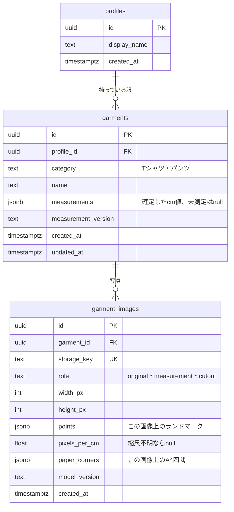

# ER図

初期テーブルは`supabase/migrations/20261010000100_garment_measurements.sql`、透過画像の追加は`20261010000200_garment_cutouts.sql`。アバターとコーデのテーブルはまだ作っていない。

- profilesのデモ用1行を`supabase/seed.sql`で用意する。apiはDEMO_PROFILE_IDだけを使用する。
- categoryはshort_sleeve_top・trousers。measurementsは[API一覧](api.md)の共通型。
- 画像は服1着につき各roleを1枚ずつ保存できる。現在のv2ではランドマーク・A4四隅ともmeasurement画像に保存する。cutoutは表示用PNGでpoints・paper_cornersは空配列、pixels_per_cmはnull。旧v1ではA4四隅はoriginal画像にある。
- 元画像とはブラウザで向き・縮小・EXIF除去を確定した画像であり、カメラの元ファイルとは異なる。
- 全テーブルでRLSを有効にし、公開ポリシーは設けない。apiのsecret keyだけがDBを操作する。
- Storageは非公開のgarmentsバケット。JPEG・PNGを許可し、1枚8MiBまで。apiが期限付きURLを発行する。
- Storageの画像はDBの外部キー削除では消えないため、削除サービスが両方を処理する。

## 今後の設計候補

アバターはprofilesと1対1、コーデはprofilesと1対多、コーデと服は中間テーブルで多対多を想定する。体型・テクスチャの要件は[要件候補](requirements-candidates.md)を参照。
