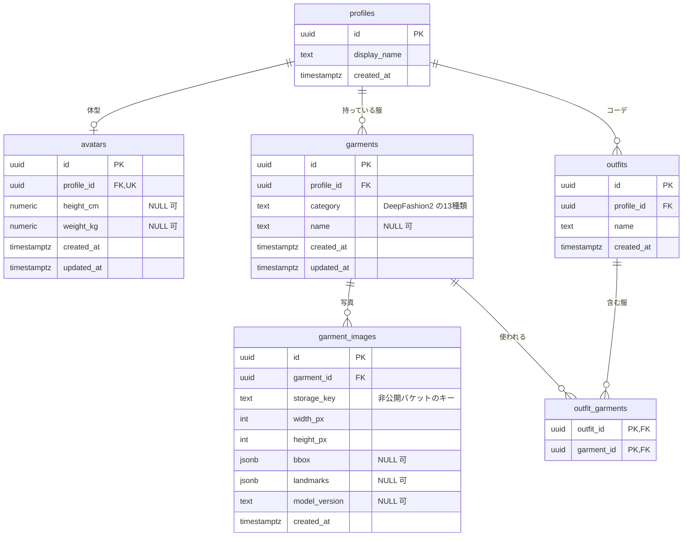

# ER 図

最低限の ER 図。要件は変わる前提なので、足すかもしれないデータは [requirements-candidates.md](requirements-candidates.md) に置いてある。まだ migration は無い。

- `profiles`：今は `DEMO_PROFILE_ID` の1行だけ。この行は `supabase/seed.sql` で入れる（無いと、服などの登録が外部キーで失敗する）。ログインを入れたら、`id` を Supabase Auth のユーザー ID と同じ値にする
- `garments.category`：`short_sleeve_top` / `long_sleeve_top` / `short_sleeve_outwear` / `long_sleeve_outwear` / `vest` / `sling` / `shorts` / `trousers` / `skirt` / `short_sleeve_dress` / `long_sleeve_dress` / `vest_dress` / `sling_dress`
- `garment_images.bbox`・`landmarks`：画像の座標なので、服ではなく画像に持たせる。推論に失敗しても保存できるよう NULL を許す。形式は [API 一覧](api.md#共通の型)
- RLS：全テーブルで有効にし、ポリシーは付けない。ブラウザ用のキーでは何も読めず、api だけが secret key で触れる
- Storage：バケットは非公開。画像は api が期限付きの URL を発行して返す
- `outfits`・`outfit_garments`：任意。後回しにしてよい

## 参考文献

- [Supabase: Row Level Security](https://supabase.com/docs/guides/database/postgres/row-level-security)：RLS を有効にしてポリシーが無ければ、publishable key では何も読めない
- [SupabaseのANON_KEYとSERVICE_ROLE_KEYの違いをちゃんと理解する（Zenn）](https://zenn.dev/seekseep/articles/supabase-anon-key-vs-service-role-key)
- [DeepFashion2（GitHub）](https://github.com/switchablenorms/DeepFashion2)
